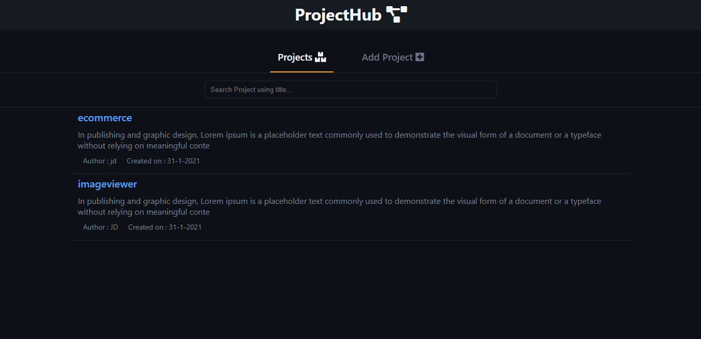
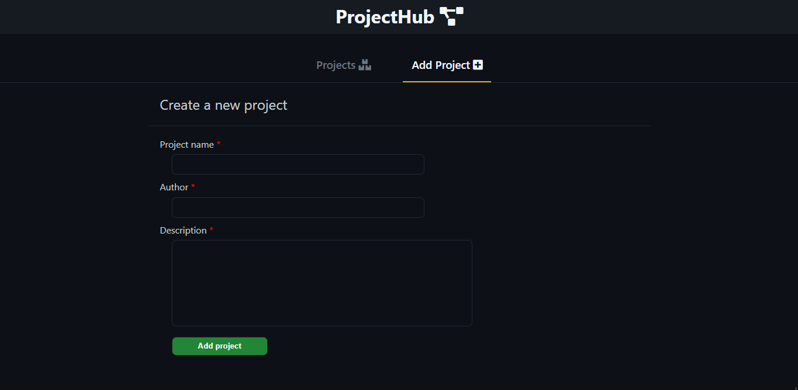
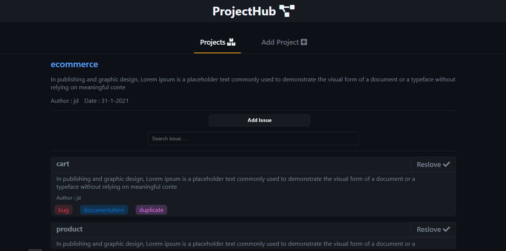
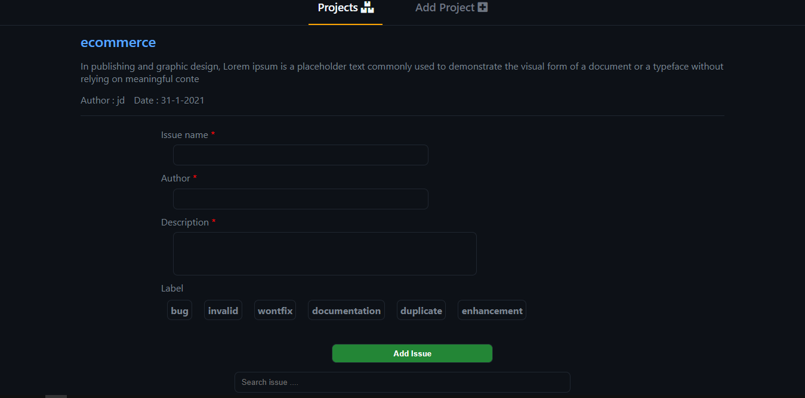

## [`Issue tracker React Demo`](https://devilzer.github.io/issue-tracker/)
## [`video walkthru`](https://drive.google.com/file/d/1ZLQatbCm9U2qtFG_GmNXsaQh_LdyAjLD/view?usp=sharing)

## Features

* Add new Projects.
* Add or reslove issues.
* color coded labels.
* Persistant redux state.
* Search based Projects filter.
* Search based issue filter.

## How to install and run?

1. Clone the repositories.
2. Install all dependencies by `npm install`
3. `npm start`

## App Overview.

#### Home page.
 

#### Add Project page.
 

#### Product Detail page.
 

#### Add issue page.
 

## Directory Structure
`components` Contains all the React components. 
`redux` Contains Redux State mangement files (acitons,reducers). 
`style` Contains SCSS file for App styling. 
